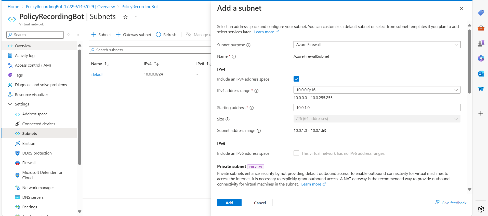
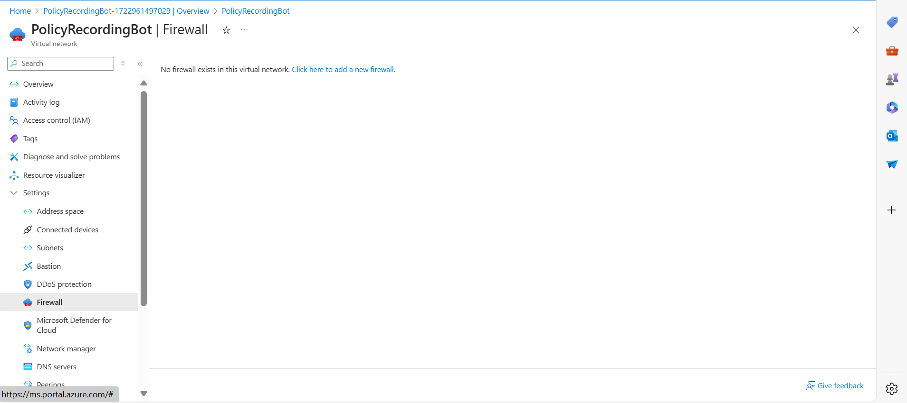

# Steps to Configure Azure Firewall
=====================================

## Step 1: Create a Virtual Network and Subnet for Azure Firewall

    1. Go to Virtual Network or create a new one if it doesn't exist.
    2. Create a subnet for the firewall with the purpose set to "Azure Firewall". 
    3. Go to the firewall section and click on "Add firewall". 

## Step 2: Configure Firewall Settings

    1. Choose a name for the firewall (e.g., "MyFirewall").
    2. Create a new firewall policy. 
    3. Select the existing Virtual Network.
    4. Create a new public IP address (e.g., "MyFWPublicIP").
    5. Review and create the firewall.

## Step 3: Configure Firewall Policy

    1. Open the firewall policy created in Step 2.
    2. Navigate to Settings.

### 3.3: Configure Application Rules (Ingress)

    Add an application rule:
    a. Give a descriptive name.
    b. Select "Application rule collection" as the rule type.
    c. Assign the lowest number as the priority.
    d. Specify a name for the rule.
    e. Define the source (e.g., your VM subnet) or use `*` to allow all IP addresses.
    f. Allow specific domains (e.g., `policyrecordingbot.eastus.cloudapp.azure.com`).
    g. Save the rule.

### 3.4: Configure Network Rules (Egress)

    Add a network rule:
    a. Give a descriptive name.
    b. Select "Network rule collection" as the rule type.
    c. Assign the lowest number as the priority.
    d. Specify a name for the rule.
    e. Define the source (e.g., your VM subnet) or use `*` to allow all IP addresses.
    f. Specific external IPs or ranges (e.g., 192.168.1.0/24 for a subnet) instead of using 0.0.0.0/0 for all. This ensures that only trusted sources can access your service. If you want to allow access from all IPs, you can configure it as 0.0.0.0/0.
    g. Specify only particular protocols and ports you want to allow. For example, you may configure TCP ports like 9444, 8445, 9442, 443, and port ranges like 10100-10199 and 20100-20199. If you want to restrict access to everything else, you should mention specific configurations like below:
     Allowed TCP ports: 9444, 8445, 9442, 443, 9441, 10100-10199, 20100-20199.
     All other ports and protocols will be restricted.
    h. Save the rule.

### 3.5: Firewall Configuration Summary

    1. Specify External IPs or Ranges
     Allow only specific external IPs or ranges (e.g., 192.168.1.0/24 for a subnet) instead of using 0.0.0.0/0 for all. This ensures that only trusted sources can access your service. If you want to allow access from all IPs, you can configure it as 0.0.0.0/0.

    Example:
    To allow access from a specific subnet:
     Allow: 192.168.1.0/24

    To allow access from all IPs:
     Allow: 0.0.0.0/0

    2. Specify Allowed Protocols and Ports
      You can specify only particular protocols and ports you want to allow. For example, configure the following:
      Allowed TCP Ports: 9444 (SignalingPort)
      8445 (MediaPort)
      9442 (TcpForwardingPort)
      443 (DefaultEndpoint)
      9441 (localPort)
      10100-10199 (InstanceCallControlEndpoint)
      20100-20199 (InstanceMediaControlEndpoint)

     * All other ports and protocols will be restricted.

     Example of Ingress Allow Rules:

     a. Allow TCP Port 9444:
      Rule Name: Allow SignalingPort
      Action: Allow
      Protocol: TCP
      Port: 9444

     b. Allow TCP Port 8445:
      Rule Name: Allow MediaPort
      Action: Allow
      Protocol: TCP
      Port: 8445

     c. Allow TCP Port 9442:
      Rule Name: Allow TcpForwardingPort
      Action: Allow
      Protocol: TCP
      Port: 9442

     d. Allow TCP Port 443:
      Rule Name: Allow DefaultEndpoint
      Action: Allow
      Protocol: TCP
      Port: 443

     e. Allow TCP Port 9441:
      Rule Name: Allow LocalPort
      Action: Allow
      Protocol: TCP
      Port: 9441

     f. Allow TCP Port Range 10100-10199:
      Rule Name: Allow InstanceCallControlEndpoint
      Action: Allow
      Protocol: TCP
      Port Range: 10100-10199

     g. Allow TCP Port Range 20100-20199:
      Rule Name: Allow InstanceMediaControlEndpoint
      Action: Allow
      Protocol: TCP
      Port Range: 20100-20199

    3. Restrict All Other Ingress Ports and Protocols:
       After creating the allow rules, add a rule to deny all other traffic. This ensures that any port or protocol not explicitly allowed is blocked.

    Example of Deny Rule:

     Deny All Other Ingress Traffic:
      Rule Name: Deny All Other Ingress Traffic
      Action: Deny
      Protocol: Any
      Port: Any

    Example of Egress Allow Rules
     a. Allow TCP Port 9444:
      Rule Name: Allow Egress SignalingPort
      Action: Allow
      Protocol: TCP
      Port: 9444

     b. Allow TCP Port 8445:
      Rule Name: Allow Egress MediaPort
      Action: Allow
      Protocol: TCP
      Port: 8445

     c. Allow TCP Port 9442:
      Rule Name: Allow Egress TcpForwardingPort
      Action: Allow
      Protocol: TCP
      Port: 9442

     d. Allow TCP Port 443:
      Rule Name: Allow Egress DefaultEndpoint
      Action: Allow
      Protocol: TCP
      Port: 443

     e. Allow TCP Port 9441:
      Rule Name: Allow Egress LocalPort
      Action: Allow
      Protocol: TCP
      Port: 9441

     f. Allow TCP Port Range 10100-10199:
      Rule Name: Allow Egress InstanceCallControlEndpoint
      Action: Allow
      Protocol: TCP
      Port Range: 10100-10199

     g. Allow TCP Port Range 20100-20199:
      Rule Name: Allow Egress InstanceMediaControlEndpoint
      Action: Allow
      Protocol: TCP
      Port Range: 20100-20199

    4. Restrict All Other Egress Ports and Protocols
     * Similarly, add a rule to deny all other egress traffic.
    
   Example of Deny Rule: 
    Deny All Other Egress Traffic:
     Rule Name: Deny All Other Egress Traffic
     Action: Deny
     Protocol: Any
     Port: Any